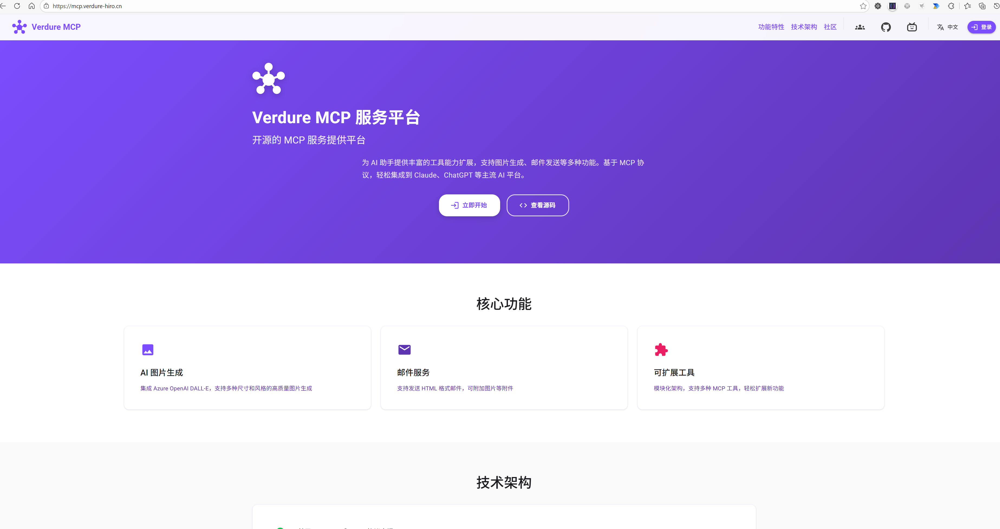

<div align="center">

# 🌿 Verdure MCP Server

**功能全面的 MCP (模型上下文协议) 服务器，支持物联网设备集成**

[](LICENSE)
[](https://dotnet.microsoft.com/)
[](https://modelcontextprotocol.io/)

[功能特性](#-功能特性) • [快速开始](#-快速开始) • [文档](#-文档) • [系统架构](#-系统架构)

**中文 | [English](README.en.md)**

</div>

---

## 📸 项目展示

<div align="center">

### Web 管理界面

*直观的 Web 界面，用于管理 MCP 工具、设备和服务*

### IoT 设备硬件

*带扬声器模块的 ESP32 设备 - 通过 SignalR 连接到 Verdure MCP*

</div>

---

## ✨ 功能特性

### 🔧 **MCP 协议支持**
- 完全符合 [模型上下文协议](https://modelcontextprotocol.io/) 规范
- 支持多工具端点与分类路由
- 可流式传输的 HTTP 传输层
- Bearer Token 身份验证

### 🎨 **AI 驱动的工具**
- **图像生成**：Azure OpenAI DALL-E 集成，支持自定义参数
- **邮件通知**：通过 SMTP 发送生成的内容
- **音乐/音频播放**：触发连接设备的音频播放
- **调试工具**：请求检查和头部分析

### 📡 **物联网设备集成**
- **SignalR 设备中心**：实时双向通信
- **ESP32 支持**：为 ESP32/物联网设备优化
- **设备注册表**：跟踪和管理连接的设备
- **用户-设备绑定**：多用户设备共享功能
- **实时推送通知**：向设备发送命令和消息

### ⚙️ **生产就绪的基础设施**
- **异步处理**：Hangfire 后台作业队列
- **PostgreSQL 存储**：强大的数据持久化
- **Keycloak 集成**：企业级身份验证
- **基于角色的访问**：细粒度权限控制
- **Docker 支持**：容器化部署就绪
- **健康检查**：内置监控端点

---

## 📋 目录

- [快速开始](#-快速开始)
- [系统架构](#-系统架构)
- [MCP 工具](#-mcp-工具)
- [物联网设备中心](#-物联网设备中心)
- [API 端点](#-api-端点)
- [配置说明](#-配置说明)
- [身份验证](#-身份验证)
- [部署指南](#-部署指南)
- [文档](#-文档)

---

## 🚀 快速开始

### 前置要求

- **.NET 10.0 SDK** 或更高版本
- **PostgreSQL** 数据库
- **Azure OpenAI** 资源和 DALL-E 部署（可选，用于图像生成）
- **Keycloak** 服务器（可选，用于生产环境身份验证）

### 安装步骤

1. **克隆仓库**
   ```bash
   git clone https://github.com/maker-community/verdure-mcp.git
   cd verdure-mcp
   ```

2. **设置 PostgreSQL 数据库**
   ```bash
   createdb verdure_mcp
   ```

3. **配置应用设置**
   
   更新 [appsettings.json](src/Verdure.Mcp.Server/appsettings.json) 或使用用户机密：
   ```bash
   cd src/Verdure.Mcp.Server
   dotnet user-secrets set "AzureOpenAI:ApiKey" "你的-api-密钥"
   dotnet user-secrets set "ConnectionStrings:DefaultConnection" "你的连接字符串"
   ```

4. **运行数据库迁移**
   ```bash
   dotnet ef database update
   ```

5. **启动服务器**
   ```bash
   dotnet run
   ```

6. **验证安装**
   - Web 界面：`http://localhost:5000`
   - 健康检查：`http://localhost:5000/health`
   - MCP 端点：`http://localhost:5000/mcp`
   - Hangfire 仪表板：`http://localhost:5000/hangfire`

---

## 🏗️ 系统架构

### 项目结构

```
src/
├── 🌐 Verdure.Mcp.Server/           # 主 MCP 服务器应用程序
│   ├── Tools/                        # MCP 工具实现
│   │   ├── GenerateImageTool.cs      # 🎨 AI 图像生成
│   │   ├── EmailTool.cs              # 📧 邮件通知
│   │   ├── MusicTool.cs              # 🎵 音频播放控制
│   │   └── DebugTool.cs              # 🔍 请求调试
│   ├── Hubs/                         # SignalR 中心
│   │   └── DeviceHub.cs              # 📡 物联网设备通信
│   ├── Endpoints/                    # REST API 端点
│   │   ├── DeviceEndpoints.cs        # 设备管理 API
│   │   └── AdminEndpoints.cs         # 管理员令牌管理
│   ├── Services/                     # 业务逻辑服务
│   │   └── DevicePushServiceImpl.cs  # 设备推送服务
│   └── Program.cs                    # 应用程序入口点
│
├── 📦 Verdure.Mcp.Domain/            # 领域模型和实体
│   ├── Entities/
│   │   ├── ImageGenerationTask.cs    # 图像任务实体
│   │   ├── ApiToken.cs               # 身份验证令牌
│   │   ├── Device.cs                 # 物联网设备实体
│   │   ├── DeviceConnection.cs       # 活动连接
│   │   └── DeviceBinding.cs          # 设备共享关系
│   └── Enums/
│       ├── ImageTaskStatus.cs
│       ├── DeviceStatus.cs
│       └── DeviceBindingStatus.cs
│
├── 🔧 Verdure.Mcp.Infrastructure/    # 基础设施服务
│   ├── Data/
│   │   └── McpDbContext.cs           # EF Core 数据库上下文
│   └── Services/
│       ├── ImageGenerationService.cs  # Azure OpenAI 集成
│       ├── EmailService.cs            # MailKit 邮件服务
│       └── TokenValidationService.cs  # 令牌管理
│
└── 🎨 Verdure.Mcp.Web/               # Blazor Web 界面
    ├── Pages/                        # Web 页面
    ├── Components/                   # 可重用组件
    └── Services/                     # 前端服务
```

### 技术栈

| 层级 | 技术 |
|------|------|
| **后端** | ASP.NET Core 10.0, SignalR, Minimal APIs |
| **前端** | Blazor WebAssembly, Bootstrap 5 |
| **数据库** | PostgreSQL, Entity Framework Core |
| **身份验证** | Keycloak, JWT Bearer Tokens |
| **后台作业** | Hangfire |
| **AI 服务** | Azure OpenAI (DALL-E 3) |
| **邮件** | MailKit/SMTP |
| **容器化** | Docker, Docker Compose |

---

## 🛠️ MCP 工具

服务器根据连接的端点提供不同的工具集。所有 MCP 端点都以 `/mcp` 结尾，以标识为可流式传输的 HTTP 协议端点。

### 🎯 可用端点

| 端点 | 可用工具 | 用途 |
|------|---------|------|
| `/mcp` 或 `/all/mcp` | 所有工具 | 通用 MCP 客户端 |
| `/image/mcp` | 仅图像生成 | AI 图像工作流 |
| `/email/mcp` | 仅邮件工具 | 通知系统 |
| `/music/mcp` | 音乐/音频工具 | 物联网音频控制 |
| `/debug/mcp` | 调试工具 | 开发和测试 |

### 🔨 工具目录

#### 1️⃣ **generate_image** - AI 图像生成

使用 Azure OpenAI DALL-E 3 生成高质量图像。

**参数：**
- `prompt`（必需，字符串）：图像描述文本
- `size`（可选，字符串）：图像尺寸
  - `1024x1024` - 正方形（默认）
  - `1792x1024` - 横向
  - `1024x1792` - 纵向
- `quality`（可选，字符串）：
  - `standard` - 更快，成本更低（默认）
  - `hd` - 更高细节和质量
- `style`（可选，字符串）：
  - `vivid` - 超现实，戏剧性（默认）
  - `natural` - 更自然，不太戏剧性

**请求头：**
- `Authorization`：Bearer token（必需）
- `X-User-Email`：接收生成图像的邮箱地址
- `X-User-Id`：启用异步处理

**示例：**
```json
{
  "name": "generate_image",
  "arguments": {
    "prompt": "日落时分宁静的日式庭院，樱花盛开",
    "size": "1792x1024",
    "quality": "hd",
    "style": "natural"
  }
}
```

#### 2️⃣ **get_image_task_status** - 检查图像生成状态

获取异步图像生成任务的状态。

**参数：**
- `taskId`（必需，字符串）：异步图像生成返回的任务 ID

**响应：**
```json
{
  "status": "Completed",
  "imageUrl": "https://...",
  "createdAt": "2026-02-01T10:30:00Z"
}
```

#### 3️⃣ **send_email** - 邮件通知

发送带可选图像附件的邮件。

**参数：**
- `toEmail`（必需，字符串）：收件人邮箱地址
- `subject`（必需，字符串）：邮件主题行
- `body`（必需，字符串）：邮件正文（支持 HTML）
- `imageBase64`（可选，字符串）：Base64 编码的图像数据
- `imageName`（可选，字符串）：附件文件名（默认：`image.png`）

#### 4️⃣ **play_random_music** - 触发音频播放

向连接的物联网设备推送随机音频播放命令。

**参数：**
- `userId`（可选，字符串）：目标用户 ID（广播到其设备）

**用途：** 在带扬声器模块的 ESP32 设备上触发音频播放。

#### 5️⃣ **debug_headers** - 检查请求头

调试工具，用于查看服务器接收到的所有 HTTP 头。

**响应：** 包含所有请求头的 JSON 对象。

---

## 📡 物联网设备中心

Verdure MCP 包含强大的 SignalR 中心，用于与 ESP32 和其他物联网设备进行实时通信。

### 核心功能

- ✅ **基于 WebSocket** 的实时双向通信
- ✅ **基于令牌的身份验证**，通过查询字符串传递
- ✅ **用户-设备绑定**，支持多用户场景
- ✅ **设备状态跟踪** 和心跳监控
- ✅ **从服务器推送通知** 到设备
- ✅ **设备注册**，支持元数据

### 快速连接示例（ESP32）

```cpp
// 使用访问令牌连接到 SignalR 中心
String hubUrl = "wss://your-server.com/hub/device?access_token=YOUR_TOKEN";
hub_connection.start(hubUrl);

// 连接后注册设备
hub_connection.invoke("RegisterDevice", macAddress, deviceToken, metadataJson);

// 监听服务器消息
hub_connection.on("CustomMessage", [](const char* message) {
    // 处理来自服务器的传入命令
    Serial.println(message);
});
```

### 中心端点

| 中心路由 | 用途 | 身份验证 |
|---------|------|---------|
| `/hub/device` | 设备连接和管理 | 通过查询字符串的访问令牌 |

### 中心方法

**客户端 → 服务器：**
- `RegisterDevice(macAddress, deviceToken, metadata)` - 注册/更新设备信息
- `Heartbeat()` - 发送保活信号

**服务器 → 客户端：**
- `Notification` - 连接确认
- `CustomMessage` - 向设备推送命令/数据
- `DeviceCommand` - 结构化设备控制命令

### 设备管理 API

用于管理设备的 REST API（需要身份验证）：

```bash
# 获取当前用户的所有设备
GET /api/devices

# 获取特定设备
GET /api/devices/{deviceId}

# 获取活动连接
GET /api/devices/connections

# 向用户的设备推送消息
POST /api/devices/push
{
  "userId": "user-123",
  "message": "你好，设备！"
}

# 向特定设备推送
POST /api/devices/{deviceId}/push
{
  "message": "设备专用命令"
}
```

📖 **完整文档：** [SignalR 设备中心文档](docs/SIGNALR_DEVICE_HUB.md)

---

## 🔐 身份验证

### 基于令牌的身份验证

服务器使用 **Bearer token 身份验证** 进行 API 和 MCP 访问。令牌使用 PBKDF2 哈希安全存储，进行 100,000 次迭代。

#### 开发模式（创建令牌）

使用管理端点创建令牌（仅开发模式）：

```bash
# 创建新的 API 令牌
curl -X POST "http://localhost:5000/admin/tokens?name=my-app-token"

# 响应：
{
  "token": "vtk_abc123def456...",
  "name": "my-app-token",
  "createdAt": "2026-02-01T10:00:00Z"
}
```

⚠️ **安全提示：** 管理令牌端点仅在开发模式下可用。

#### 使用令牌

**MCP 客户端（Claude Desktop）：**
```json
{
  "mcpServers": {
    "verdure": {
      "transport": {
        "type": "http",
        "url": "http://localhost:5000/mcp",
        "headers": {
          "Authorization": "Bearer vtk_你的令牌"
        }
      }
    }
  }
}
```

**REST API：**
```bash
curl -H "Authorization: Bearer vtk_你的令牌" \
     http://localhost:5000/api/devices
```

**SignalR（ESP32）：**
```cpp
// 令牌作为查询参数传递
String url = "ws://server.com/hub/device?access_token=vtk_你的令牌";
```

### Keycloak 集成（生产环境）

对于生产部署，与 Keycloak 集成以实现企业单点登录：

```json
{
  "Authentication": {
    "Schemes": {
      "Keycloak": {
        "Authority": "https://keycloak.example.com/realms/your-realm",
        "Audience": "verdure-mcp",
        "ValidateAudience": true,
        "RequireHttpsMetadata": true
      }
    }
  }
}
```

---

## ⚙️ 配置说明

### appsettings.json 结构

```json
{
  "ConnectionStrings": {
    "DefaultConnection": "Host=localhost;Database=verdure_mcp;Username=postgres;Password=yourpassword"
  },
  
  "AzureOpenAI": {
    "Endpoint": "https://your-resource.openai.azure.com/",
    "ApiKey": "your-api-key",
    "DeploymentName": "dall-e-3",
    "ApiVersion": "2024-02-01"
  },
  
  "Email": {
    "SmtpHost": "smtp.gmail.com",
    "SmtpPort": 587,
    "SmtpUsername": "your-email@gmail.com",
    "SmtpPassword": "your-app-password",
    "UseSsl": true,
    "FromEmail": "noreply@example.com",
    "FromName": "Verdure MCP"
  },
  
  "Authentication": {
    "RequireToken": true,
    "TokenPrefix": "vtk_"
  },
  
  "Hangfire": {
    "DashboardPath": "/hangfire",
    "WorkerCount": 5
  }
}
```

### 环境变量（生产环境推荐）

```bash
# 数据库
ConnectionStrings__DefaultConnection="Host=postgres;Database=verdure_mcp;..."

# Azure OpenAI
AzureOpenAI__ApiKey="你的安全-api-密钥"
AzureOpenAI__Endpoint="https://your-resource.openai.azure.com/"

# 邮件
Email__SmtpPassword="你的安全-smtp-密码"

# 身份验证
Authentication__RequireToken="true"
```

---

## 🚢 部署指南

### Docker 部署

#### 选项 1：Docker Compose（推荐）

```bash
# 构建并启动所有服务
docker-compose up -d

# 查看日志
docker-compose logs -f

# 停止服务
docker-compose down
```

Compose 文件包括：
- Verdure MCP 服务器
- PostgreSQL 数据库
- Keycloak（可选）

#### 选项 2：独立 Docker

```bash
# 构建镜像
docker build -t verdure-mcp:latest -f docker/Dockerfile .

# 运行容器
docker run -d \
  -p 5000:8080 \
  -e ConnectionStrings__DefaultConnection="Host=postgres;..." \
  -e AzureOpenAI__ApiKey="your-key" \
  --name verdure-mcp \
  verdure-mcp:latest
```

### 生产环境检查清单

- [ ] 对所有通信使用 HTTPS
- [ ] 将机密存储在环境变量或 Azure Key Vault 中
- [ ] 启用 `Authentication:RequireToken`
- [ ] 配置 Keycloak 或其他身份提供程序
- [ ] 设置数据库备份
- [ ] 配置日志记录和监控
- [ ] 使用反向代理（nginx/Caddy）进行 SSL 终止
- [ ] 限制 Hangfire 仪表板访问
- [ ] 检查 CORS 设置

---

## 🎓 MCP 客户端配置

### Claude Desktop 配置

要在 Claude Desktop 中使用 Verdure MCP，请添加到 MCP 配置文件：

**Windows：** `%APPDATA%\Claude\claude_desktop_config.json`  
**macOS：** `~/Library/Application Support/Claude/claude_desktop_config.json`

```json
{
  "mcpServers": {
    "verdure-all-tools": {
      "transport": {
        "type": "http",
        "url": "http://localhost:5000/mcp",
        "headers": {
          "Authorization": "Bearer vtk_你的令牌"
        }
      }
    },
    "verdure-image-only": {
      "transport": {
        "type": "http",
        "url": "http://localhost:5000/image/mcp",
        "headers": {
          "Authorization": "Bearer vtk_你的令牌"
        }
      }
    }
  }
}
```

### 自定义 MCP 客户端

```python
# Python 示例
import anthropic

client = anthropic.Anthropic(api_key="your-api-key")

response = client.messages.create(
    model="claude-3-5-sonnet-20241022",
    max_tokens=1024,
    mcp_servers=[
        {
            "type": "http",
            "url": "http://localhost:5000/mcp",
            "headers": {
                "Authorization": "Bearer vtk_你的令牌"
            }
        }
    ],
    messages=[
        {
            "role": "user",
            "content": "生成一个未来城市的图像"
        }
    ]
)
```

---

## 📚 文档

| 文档 | 描述 |
|------|------|
| [SignalR 设备中心](docs/SIGNALR_DEVICE_HUB.md) | 物联网设备集成完整指南 |
| [角色实现](docs/ROLE_IMPLEMENTATION_SUMMARY.md) | 基于角色的访问控制设置 |
| [测试指南](docs/TESTING.md) | 测试策略和示例 |
| [工具分类](docs/TOOL_CATEGORY_GUIDE.md) | 组织和分类 MCP 工具 |
| [Docker 部署](docker/README.md) | 容器化详细信息 |

---

## 🔄 异步处理

当请求中存在 `X-User-Id` 头时，**图像生成任务** 将使用 Hangfire 异步处理。

### 优势
- ✅ 非阻塞 API 响应
- ✅ 失败任务的重试逻辑
- ✅ 通过任务 ID 跟踪进度
- ✅ 后台作业监控（Hangfire 仪表板）

### 使用示例

```bash
# 触发异步图像生成
curl -X POST http://localhost:5000/mcp \
  -H "Authorization: Bearer vtk_token" \
  -H "X-User-Id: user123" \
  -H "Content-Type: application/json" \
  -d '{
    "name": "generate_image",
    "arguments": {
      "prompt": "美丽的风景"
    }
  }'

# 响应：
{
  "taskId": "abc-123-def",
  "status": "Pending"
}

# 稍后检查状态
curl -X POST http://localhost:5000/mcp \
  -H "Authorization: Bearer vtk_token" \
  -d '{
    "name": "get_image_task_status",
    "arguments": {
      "taskId": "abc-123-def"
    }
  }'
```

---

## 🔒 安全特性

### 令牌安全
- **PBKDF2 哈希**：100,000 次迭代，随机盐
- **恒定时间比较**：防止计时攻击
- **前缀验证**：`vtk_` 前缀易于识别

### 输入验证
- **HTML 编码**：防止邮件内容中的 XSS
- **SQL 参数化**：防止 SQL 注入
- **模式验证**：所有 MCP 输入根据 JSON 模式验证

### 网络安全
- **CORS 配置**：限制性 CORS 策略
- **HTTPS 强制**：生产模式需要 HTTPS
- **速率限制**：可配置的请求节流（Hangfire）

---

## 🤝 贡献

欢迎贡献！请遵循以下准则：

1. Fork 仓库
2. 创建功能分支（`git checkout -b feature/amazing-feature`）
3. 提交您的更改（`git commit -m 'Add amazing feature'`）
4. 推送到分支（`git push origin feature/amazing-feature`）
5. 打开 Pull Request

---

## 📄 许可证

本项目采用 MIT 许可证 - 详情请参阅 [LICENSE](LICENSE) 文件。

---

## � 社区与支持

### 加入我们的社区，获取帮助和分享经验！

<div align="center">

| 💬 **QQ 交流群** | 📺 **B站 UP主** | 🐙 **GitHub 社区** |
|:---:|:---:|:---:|
| **绿荫DIY硬件交流群** | **绿荫阿广** | **Maker Community** |
| 群号：**1023487000** | [访问主页](https://space.bilibili.com/25228512) | [访问组织](https://github.com/maker-community) |
| 讨论 AI、MCP 和硬件 DIY | 获取更多 AI 和创客教程 | 贡献代码，参与开发 |

</div>

### 📮 联系方式

- **📧 问题反馈**: [GitHub Issues](https://github.com/maker-community/verdure-mcp/issues)
- **💡 功能建议**: [GitHub Discussions](https://github.com/maker-community/verdure-mcp/discussions)
- **🎥 视频教程**: [B站 @绿荫阿广](https://space.bilibili.com/25228512)
- **🔗 小智转接平台**: [Verdure MCP for XiaoZhi](https://github.com/maker-community/verdure-mcp-for-xiaozhi) - 专为小智 AI 助手设计的 MCP 转接服务，提供在线平台和多租户 SaaS 解决方案

---

## 🌟 致谢

感谢以下开源项目和技术：

- [模型上下文协议](https://modelcontextprotocol.io/) - 协议规范
- [Azure OpenAI](https://azure.microsoft.com/zh-cn/products/ai-services/openai-service) - AI 服务
- [Anthropic Claude](https://www.anthropic.com/) - MCP 客户端参考
- [ESP32 社区](https://github.com/maker-community) - 物联网设备支持
- [Microsoft .NET](https://dotnet.microsoft.com/) - 强大的跨平台开发框架
- [Keycloak](https://www.keycloak.org/) - 开源的身份认证和访问管理解决方案
- [Entity Framework Core](https://docs.microsoft.com/ef/core/) - 现代化的 ORM 框架

特别感谢所有支持和使用本项目的开发者和创客！

⭐ **如果这个项目对你有帮助，请给我们一个 Star！** ⭐

---

<div align="center">

**Made with ❤️ by [绿荫阿广](https://space.bilibili.com/25228512) and the [Maker Community](https://github.com/maker-community)**

[报告 Bug](https://github.com/maker-community/verdure-mcp/issues) • [请求功能](https://github.com/maker-community/verdure-mcp/issues) • [🏠 返回顶部](#-verdure-mcp-server)

</div>

