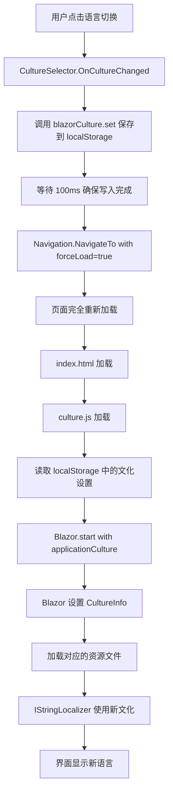

# 多语言切换修复说明 (Localization Fix)

## 问题描述

多语言切换功能不生效，用户点击语言切换按钮后页面刷新，但界面语言没有改变。

## 根本原因

当前项目缺少关键的 **Blazor 启动时文化配置**。主要问题：

1. **index.html** 中的 `blazor.webassembly.js` 使用默认自动启动，没有传入 `applicationCulture` 参数
2. **Program.cs** 中手动设置的文化会在 Blazor 启动后被重置

## 解决方案

参考 Microsoft 官方示例和 `verdure-mcp-for-xiaozhi` 项目，实现正确的文化设置流程：

### 1. 修改 index.html

**位置**: `src/Verdure.Mcp.Web/wwwroot/index.html`

**关键改动**:
- 添加 `autostart="false"` 到 blazor.webassembly.js
- 添加 Blazor 启动脚本，使用 `Blazor.start({ applicationCulture })`

```html
<script src="_framework/blazor.webassembly.js" autostart="false"></script>

<script>
    // Microsoft Official Approach: Set culture before Blazor starts
    (function() {
        const savedCulture = window.blazorCulture.get() || 'zh-CN';
        console.log('🌐 Starting Blazor with culture:', savedCulture);
        
        // Update HTML lang attribute
        document.documentElement.lang = savedCulture;
        
        // Start Blazor with the specified culture
        Blazor.start({
            applicationCulture: savedCulture
        }).then(() => {
            console.log('✅ Blazor started successfully with culture:', savedCulture);
        }).catch((error) => {
            console.error('❌ Failed to start Blazor:', error);
        });
    })();
</script>
```

### 2. 修改 Program.cs

**位置**: `src/Verdure.Mcp.Web/Program.cs`

**改动**: 移除手动设置文化的代码

**移除的代码**:
```csharp
// ❌ 删除这段代码
var culture = new CultureInfo("zh-CN");
CultureInfo.DefaultThreadCurrentCulture = culture;
CultureInfo.DefaultThreadCurrentUICulture = culture;
```

**原因**: Blazor 会在启动时根据 `applicationCulture` 参数自动设置文化，手动设置会被覆盖。

## 工作流程

现在多语言切换的完整流程如下：



## 技术细节

### Blazor WebAssembly 文化机制

1. **启动时设置**: 必须在 `Blazor.start()` 时通过 `applicationCulture` 参数设置
2. **资源加载**: Blazor 会自动加载对应的卫星程序集（如 `zh-CN\Verdure.Mcp.Web.resources.dll`）
3. **IStringLocalizer**: 自动使用当前文化的资源文件

### 为什么必须使用 Blazor.start()

根据 Microsoft 官方文档：
- Blazor WebAssembly 的文化设置必须在应用启动时完成
- 运行时无法动态更改文化（因为资源文件在编译时绑定）
- 因此切换语言需要完全重新加载应用

## 参考资源

- [Microsoft ASP.NET Core Globalization Sample](https://github.com/dotnet/aspnetcore/tree/main/src/Components/test/testassets/GlobalizationWasmApp)
- [verdure-mcp-for-xiaozhi 项目实现](https://github.com/maker-community/verdure-mcp-for-xiaozhi)
- [Blazor WebAssembly Localization Documentation](https://learn.microsoft.com/en-us/aspnet/core/blazor/globalization-localization)

## 测试验证

修复后，进行以下测试：

1. ✅ 打开应用，默认显示中文
2. ✅ 点击语言切换器，选择 English
3. ✅ 页面刷新后，所有文本显示为英文
4. ✅ 再次切换回中文，文本恢复中文
5. ✅ 刷新页面，语言设置保持不变（localStorage 持久化）
6. ✅ 打开浏览器控制台，查看日志：
   - `🌐 Starting Blazor with culture: zh-CN` 或 `en`
   - `✅ Blazor started successfully with culture: ...`

## 总结

本次修复实现了正确的 Blazor WebAssembly 多语言切换机制，关键点是：

1. 使用 `Blazor.start({ applicationCulture })` 在启动时设置文化
2. 不在 Program.cs 中手动设置文化
3. 通过 `forceLoad: true` 强制页面重新加载以应用新文化
4. 使用 localStorage 持久化用户的语言选择

---

**修复日期**: 2025-11-30  
**修复人**: GitHub Copilot  
**参考项目**: verdure-mcp-for-xiaozhi
