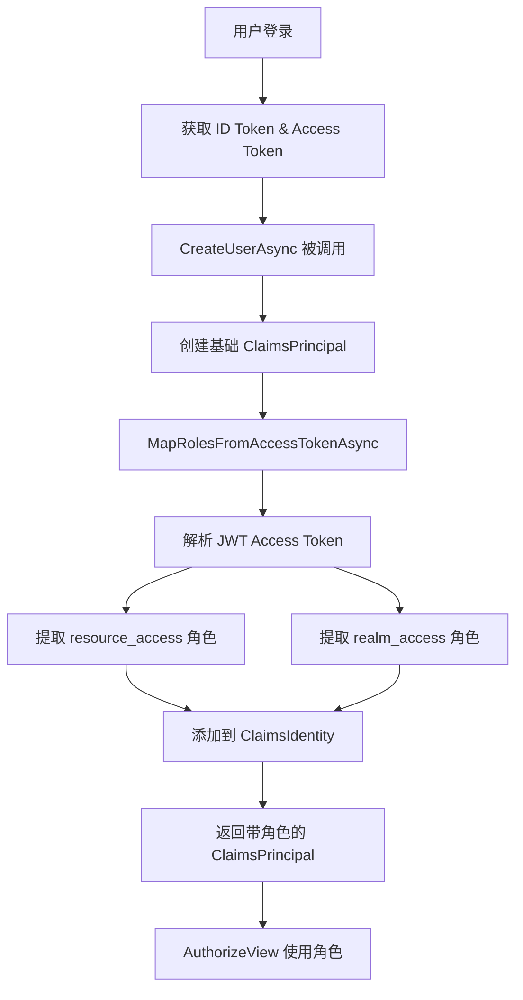

# Keycloak 角色解析实现文档

## 概述

本项目实现了基于 Keycloak 的用户角色解析机制,通过自定义 `KeycloakRoleClaimsPrincipalFactory` 从 Keycloak 的 Access Token 中提取角色信息,并映射到 ASP.NET Core 标准的 Claims 系统中。

## 核心组件

### 1. KeycloakRoleClaimsPrincipalFactory

位置: `src/Verdure.Mcp.Web/Services/KeycloakRoleClaimsPrincipalFactory.cs`

这是核心的角色解析工厂类,继承自 `AccountClaimsPrincipalFactory<RemoteUserAccount>`,负责:

- 从 Access Token 中解析 JWT
- 提取 `resource_access.<clientId>.roles` 中的客户端特定角色
- 提取 `realm_access.roles` 中的 Realm 级别角色
- 过滤掉 Keycloak 默认角色
- 将角色映射为标准的 `ClaimTypes.Role` Claims

### 2. 功能特性

#### 📥 Access Token 解析
```csharp
// 从 IAccessTokenProvider 获取 Access Token
var tokenResult = await tokenProvider.RequestAccessToken();
if (tokenResult.TryGetToken(out var accessToken))
{
    var handler = new JwtSecurityTokenHandler();
    var jwtToken = handler.ReadJwtToken(accessToken.Value);
    // 处理 Claims...
}
```

#### 🔑 Resource Access 角色映射
从 Access Token 的 `resource_access` claim 中提取特定 ClientId 的角色:

```json
{
  "resource_access": {
    "verdure-mcp-server": {
      "roles": ["admin", "user", "developer"]
    }
  }
}
```

#### 🌍 Realm Access 角色映射
从 `realm_access` 中提取 Realm 级别的角色,并过滤掉默认角色:

```csharp
private static bool IsRelevantRealmRole(string role)
{
    var excludedRoles = new[]
    {
        "offline_access",
        "uma_authorization",
        "default-roles-verdure-mcp",
        "default-roles-maker-community"
    };
    return !excludedRoles.Contains(role, StringComparer.OrdinalIgnoreCase);
}
```

#### 📊 详细日志记录
使用 emoji 标记的结构化日志,方便调试:

- 🔐 认证流程
- ✅ 成功操作
- ❌ 错误信息
- ⚠️ 警告提示
- 📋 数据列表
- 🔍 查找操作
- 💡 提示信息

## 配置

### appsettings.json

```json
{
  "Keycloak": {
    "Authority": "https://auth.verdure-hiro.cn/realms/maker-community",
    "ClientId": "verdure-mcp-server",
    "ResponseType": "code"
  }
}
```

### Program.cs 注册

```csharp
builder.Services.AddOidcAuthentication(options =>
{
    builder.Configuration.Bind("Keycloak", options.ProviderOptions);
    options.ProviderOptions.ResponseType = "code";
    options.ProviderOptions.DefaultScopes.Add("openid");
    options.ProviderOptions.DefaultScopes.Add("profile");
    options.ProviderOptions.DefaultScopes.Add("email");
    options.ProviderOptions.DefaultScopes.Add("offline_access");
})
.AddAccountClaimsPrincipalFactory<KeycloakRoleClaimsPrincipalFactory>();
```

## 使用场景

### 1. 基于角色的授权 (Razor Pages)

```razor
<AuthorizeView Roles="admin">
    <Authorized>
        <MudText Typo="Typo.subtitle2" Class="px-4 mt-4 mb-2">管理</MudText>
        <MudNavLink Href="/admin/services" Icon="@Icons.Material.Filled.Settings">
            MCP 服务管理
        </MudNavLink>
    </Authorized>
</AuthorizeView>
```

### 2. 程序化角色检查

```csharp
private string GetRoles(System.Security.Claims.ClaimsPrincipal user)
{
    var roles = user.FindAll("role")
        .Concat(user.FindAll(System.Security.Claims.ClaimTypes.Role))
        .Select(c => c.Value)
        .Distinct()
        .ToList();
    
    return roles.Any() ? string.Join(", ", roles) : "普通用户";
}
```

### 3. 页面级授权

```csharp
@page "/admin/services"
@attribute [Authorize(Roles = "admin")]
```

## 角色映射流程



## 调试技巧

### 1. 启用详细日志

在 `appsettings.Development.json` 中:

```json
{
  "Logging": {
    "LogLevel": {
      "Default": "Information",
      "Verdure.Mcp.Web.Services.KeycloakRoleClaimsPrincipalFactory": "Debug"
    }
  }
}
```

### 2. 检查日志输出

查找关键日志信息:

- `🔐 Mapping Keycloak roles for user` - 开始处理
- `✅ Found ClientId 'xxx' in resource_access` - 找到客户端配置
- `📋 Extracted N roles: admin, user` - 提取的角色列表
- `➕ Added role claim: admin` - 成功添加角色
- `❌ ClientId 'xxx' not found` - 配置错误

### 3. 常见问题排查

#### 问题: 用户没有角色

**检查清单:**
1. 确认 `appsettings.json` 中的 `ClientId` 与 Keycloak 配置一致
2. 确认用户在 Keycloak 中分配了角色
3. 确认角色分配在正确的 Client 或 Realm 级别
4. 检查日志中的 `Available clients:` 信息

#### 问题: AuthorizeView 不生效

**检查:**
1. 确认角色名称大小写匹配
2. 检查浏览器控制台是否有认证错误
3. 使用 Profile 页面查看实际映射的角色

## Keycloak 配置要求

### Client 设置

1. **Access Type**: `public` (Blazor WebAssembly)
2. **Standard Flow Enabled**: `ON`
3. **Valid Redirect URIs**: 配置应用的回调 URL
4. **Web Origins**: 配置 CORS 允许的源

### 角色配置

1. **Client Roles**: 在 `verdure-mcp-server` Client 下创建角色
   - `admin` - 管理员
   - `user` - 普通用户
   - `developer` - 开发者

2. **Realm Roles**: 可选,用于跨应用的角色

### 用户角色分配

在 Keycloak 管理界面:
1. Users → 选择用户
2. Role Mappings → Client Roles
3. 选择 `verdure-mcp-server`
4. 分配相应角色

## 扩展和定制

### 添加自定义角色过滤

修改 `IsRelevantRealmRole` 方法:

```csharp
private static bool IsRelevantRealmRole(string role)
{
    var excludedRoles = new[]
    {
        "offline_access",
        "uma_authorization",
        "default-roles-verdure-mcp",
        "default-roles-maker-community",
        // 添加更多要排除的角色
        "your-custom-excluded-role"
    };
    return !excludedRoles.Contains(role, StringComparer.OrdinalIgnoreCase);
}
```

### 添加自定义 Claims

在 `CreateUserAsync` 方法中:

```csharp
// 添加自定义 claim
if (identity.IsAuthenticated)
{
    // 例如:添加组织信息
    var orgClaim = accessTokenClaims.FirstOrDefault(c => c.Type == "organization");
    if (orgClaim != null)
    {
        identity.AddClaim(new Claim("organization", orgClaim.Value));
    }
}
```

## 参考资源

- [Keycloak Documentation](https://www.keycloak.org/documentation)
- [ASP.NET Core Authorization](https://learn.microsoft.com/en-us/aspnet/core/security/authorization/)
- [Blazor WebAssembly Authentication](https://learn.microsoft.com/en-us/aspnet/core/blazor/security/webassembly/)

## 更新日志

### 2024-11-29
- ✅ 实现 `KeycloakRoleClaimsPrincipalFactory`
- ✅ 支持 `resource_access` 和 `realm_access` 角色映射
- ✅ 添加详细的调试日志
- ✅ 实现角色过滤机制
- ✅ 集成到 Blazor WebAssembly 应用
